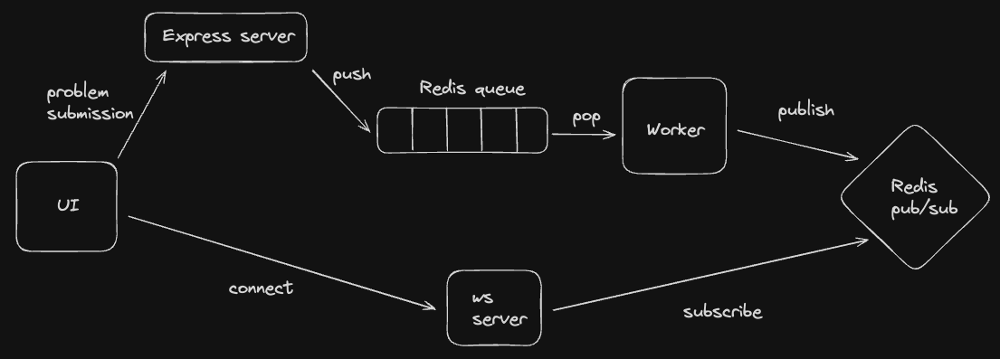

# Redis and Pub/Sub messaging practice

## Express Server

The Express Server handles user submissions by pushing them into a Redis queue.

## Worker

The Worker processes submissions from the queue and publishes successfully processed items to the 'problems_done' channel in Redis.

## WS Server

The WebSocket Server allows users to connect, send a 'problem id' message, and receive updates related to that 'problem id' from the 'problems_done' channel.

## Architecture Diagram

